# 🤖 Automated Data Cleaning Agent

[](https://www.python.org/downloads/)
[](https://opensource.org/licenses/MIT)
[](https://github.com/yourusername/data-cleaning-agent)

> **Transform messy datasets into ML-ready data with zero manual intervention**

An intelligent, autonomous data cleaning agent that systematically processes raw datasets through a comprehensive 5-phase workflow, delivering production-ready data for machine learning projects.

## ✨ Key Features

- 🔄 **Fully Automated Workflow**: 5-phase systematic data cleaning process
- 🎯 **ML-Optimized**: Tailored preprocessing for different ML tasks
- 📊 **Comprehensive Analysis**: Deep data quality assessment and profiling
- 🛡️ **Data Preservation**: Conservative approach with full audit trails
- 📈 **Quality Metrics**: Before/after comparisons with detailed reports
- 🔧 **Reproducible**: Generated Python scripts for workflow replication
- 📋 **Multiple Formats**: Support for CSV, Excel, JSON, Parquet files
- 🚨 **Smart Validation**: Automated quality gates and business rule checks

## 🚀 Quick Start

### 1. Setup
```bash
git clone https://github.com/yourusername/data-cleaning-agent.git
cd data-cleaning-agent
pip install -r requirements.txt
```

### 2. Add Your Dataset
Place your raw data file in the `dataset_original/` folder:
```
dataset_original/
└── your_dataset.csv
```

### 3. Start Cleaning
Interact with the agent using this format:
```
Dataset Information:
- Dataset file name: your_dataset.csv
- Dataset description: Customer transaction data with demographics
- Target use case: Binary classification (churn prediction)
- Specific requirements: Preserve customer IDs, conservative missing value handling
```

### 4. Get Results
Find your cleaned data and comprehensive reports in `processing_workspace/`:
```
processing_workspace/
├── cleaned_data/           # 📊 Your ML-ready datasets
├── scripts/               # 🐍 Reproducible Python scripts
├── reports/               # 📋 Quality assessment reports
└── logs/                  # 📝 Detailed processing logs
```

## 🔄 The 5-Phase Workflow

```mermaid
flowchart TD
    A[📁 Raw Dataset<br/>dataset_original/] --> B{🔍 Phase 1<br/>Dataset Validation<br/>& Discovery}
    
    B --> B1[📊 File Format Validation]
    B --> B2[🔢 Data Profiling]
    B --> B3[💾 Memory Assessment]
    B1 --> B4{✅ Valid Dataset?}
    B2 --> B4
    B3 --> B4
    
    B4 -->|❌ Invalid| B5[🚨 Error Report<br/>& Exit]
    B4 -->|✅ Valid| C{🔍 Phase 2<br/>Data Quality<br/>Assessment}
    
    C --> C1[🕳️ Missing Data Analysis<br/>MCAR/MAR/MNAR Detection]
    C --> C2[👥 Duplicate Detection<br/>Exact & Fuzzy Matching]
    C --> C3[📈 Outlier Detection<br/>Statistical Methods]
    C --> C4[🏷️ Data Type Validation<br/>Format Consistency]
    C --> C5[⚖️ Business Rule Validation<br/>Cross-field Checks]
    
    C1 --> C6[📋 Quality Report<br/>Generation]
    C2 --> C6
    C3 --> C6
    C4 --> C6
    C5 --> C6
    
    C6 --> D{🎯 Phase 3<br/>Cleaning Strategy<br/>Development}
    
    D --> D1[📊 Issue Prioritization<br/>Impact & Severity]
    D --> D2[🤖 ML-Optimized<br/>Strategy Selection]
    D --> D3[🛡️ Validation Framework<br/>Quality Thresholds]
    D --> D4[⚠️ Risk Assessment<br/>& Rollback Planning]
    
    D1 --> D5[📝 Cleaning Plan<br/>Documentation]
    D2 --> D5
    D3 --> D5
    D4 --> D5
    
    D5 --> E{🔧 Phase 4<br/>Data Cleaning<br/>Implementation}
    
    E --> E1[🔄 Missing Value Treatment<br/>Multiple Imputation]
    E --> E2[🗑️ Duplicate Resolution<br/>Rule-based Deduplication]
    E --> E3[🏷️ Data Type Standardization<br/>Format Normalization]
    E --> E4[📊 Outlier Treatment<br/>Context-aware Handling]
    E --> E5[⚙️ Feature Engineering<br/>Transformations & Encoding]
    
    E1 --> E6[💾 Cleaned Dataset<br/>Generation]
    E2 --> E6
    E3 --> E6
    E4 --> E6
    E5 --> E6
    
    E6 --> F{✅ Phase 5<br/>Quality Validation<br/>& Documentation}
    
    F --> F1[📊 Post-cleaning<br/>Quality Assessment]
    F --> F2[📈 Statistical<br/>Impact Analysis]
    F --> F3[📚 Comprehensive<br/>Documentation]
    F --> F4[📦 Deliverable<br/>Packaging]
    
    F1 --> G[🎉 Final Outputs]
    F2 --> G
    F3 --> G
    F4 --> G
    
    G --> G1[📊 cleaned_data/<br/>ML-Ready Dataset]
    G --> G2[🐍 scripts/<br/>Reproducible Code]
    G --> G3[📋 reports/<br/>Quality Reports]
    G --> G4[📝 logs/<br/>Process Audit Trail]
    
    style A fill:#e1f5fe
    style B fill:#f3e5f5
    style C fill:#fff3e0
    style D fill:#e8f5e8
    style E fill:#fff8e1
    style F fill:#f1f8e9
    style G fill:#e8f5e8
    style B5 fill:#ffebee
    
    classDef phaseBox fill:#f9f9f9,stroke:#333,stroke-width:2px,color:#333
    classDef outputBox fill:#e8f5e8,stroke:#4caf50,stroke-width:2px,color:#333
    classDef errorBox fill:#ffebee,stroke:#f44336,stroke-width:2px,color:#333
    
    class B,C,D,E,F phaseBox
    class G1,G2,G3,G4 outputBox
    class B5 errorBox
```



### Phase 1: Dataset Validation & Discovery
- File existence and format validation
- Initial data profiling and structure analysis
- Memory usage assessment and compatibility checks

### Phase 2: Data Quality Assessment
- **Missing Data Analysis**: Pattern detection (MCAR, MAR, MNAR)
- **Duplicate Detection**: Exact and near-duplicate identification
- **Outlier Detection**: Statistical and domain-specific methods
- **Data Type Validation**: Consistency and format verification
- **Business Rule Validation**: Cross-field and integrity checks

### Phase 3: Cleaning Strategy Development
- Issue prioritization by impact and severity
- Strategy selection based on ML requirements
- Validation framework design with quality thresholds
- Risk assessment and rollback planning

### Phase 4: Data Cleaning Implementation
- **Missing Value Treatment**: Multiple imputation strategies
- **Duplicate Resolution**: Rule-based deduplication
- **Data Type Standardization**: Format normalization
- **Outlier Treatment**: Context-aware handling
- **Feature Engineering**: Basic transformations and encoding

### Phase 5: Quality Validation & Documentation
- Post-cleaning quality assessment
- Statistical impact analysis
- Comprehensive documentation generation
- Deliverable packaging and handover

## 📊 Supported Data Issues

| Issue Type | Detection Method | Treatment Options |
|------------|------------------|-------------------|
| Missing Values | Pattern analysis, visualization | Imputation, deletion, flagging |
| Duplicates | Exact & fuzzy matching | Removal, consolidation, flagging |
| Outliers | Statistical methods (Z-score, IQR) | Capping, transformation, removal |
| Data Types | Validation rules | Conversion, standardization |
| Inconsistencies | Business rule validation | Correction, standardization |

## 🛠️ Technical Specifications

### Requirements
- **Python**: 3.8+
- **Memory**: 4GB+ recommended
- **Storage**: 2x dataset size for processing
- **Processing**: Supports up to 10M rows, 1000 columns

### Core Dependencies
```python
pandas >= 1.5.0          # Data manipulation
numpy >= 1.21.0          # Numerical computing
scikit-learn >= 1.1.0    # ML preprocessing
matplotlib >= 3.5.0      # Visualization
seaborn >= 0.11.0        # Statistical plots
```

### Quality Thresholds
- **Missing Value Alert**: >50% missing in any column
- **Outlier Detection**: 3-sigma rule + IQR method
- **Duplicate Similarity**: 95% field match threshold
- **Processing Timeout**: 30 minutes per phase

## 📁 Project Structure

```
data-cleaning-agent/
├── 📂 dataset_original/           # Raw datasets (read-only)
├── 📂 processing_workspace/       # Active processing area
│   ├── 📂 scripts/               # Generated Python scripts
│   ├── 📂 cleaned_data/          # Processed datasets
│   ├── 📂 reports/               # Quality reports & analysis
│   ├── 📂 plots/                 # Data visualizations
│   └── 📂 logs/                  # Processing logs
├── 📄 agent_system_prompt.md     # Agent behavior definition
├── 📄 project_config.md          # Technical configuration
├── 📄 workflow_status.md         # Progress tracking
├── 📄 instruction.md             # Detailed user guide
└── 📄 requirements.txt           # Python dependencies
```

## 🎯 Use Cases

### Perfect For:
- **Data Scientists**: Rapid dataset preparation for ML experiments
- **ML Engineers**: Standardized preprocessing pipelines
- **Business Analysts**: Automated data quality improvement
- **Research Teams**: Reproducible data cleaning workflows

### Supported ML Tasks:
- 🎯 **Classification**: Binary and multi-class problems
- 📈 **Regression**: Continuous target prediction
- 🔍 **Clustering**: Unsupervised learning preparation
- ⏰ **Time Series**: Temporal data preprocessing
- 🌐 **NLP**: Text data cleaning and preparation

## 📈 Performance Metrics

The agent tracks and reports:
- **Data Quality Score**: Overall dataset health (0-100)
- **Processing Efficiency**: Rows processed per second
- **Issue Resolution Rate**: Problems successfully addressed
- **Data Retention**: Percentage of original data preserved
- **Transformation Impact**: Statistical property changes

## 🔒 Data Safety & Compliance

- **Original Data Protection**: Never modifies source files
- **Audit Trail**: Complete transformation history
- **Rollback Capability**: Reversible operations where possible
- **Privacy Aware**: Handles PII with appropriate safeguards
- **Compliance Ready**: Supports GDPR, HIPAA requirements

## 🤝 Contributing

We welcome contributions! Please see our [Contributing Guidelines](CONTRIBUTING.md) for details.

### Development Setup
```bash
git clone https://github.com/yourusername/data-cleaning-agent.git
cd data-cleaning-agent
pip install -r requirements-dev.txt
pytest tests/
```

## 📄 License

This project is licensed under the MIT License - see the [LICENSE](LICENSE) file for details.

## 🙏 Acknowledgments

- Built with modern data science best practices
- Inspired by enterprise data quality frameworks
- Community feedback and contributions

## 📞 Support

- 📖 **Documentation**: Check `instruction.md` for detailed guidance
- 🐛 **Issues**: Report bugs via GitHub Issues
- 💬 **Discussions**: Join our community discussions
- 📧 **Contact**: [keirishanb@outlook.com]

---

**Ready to transform your messy data into ML gold?** 🏆

Start by placing your dataset in `dataset_original/` and describing your cleaning needs!
